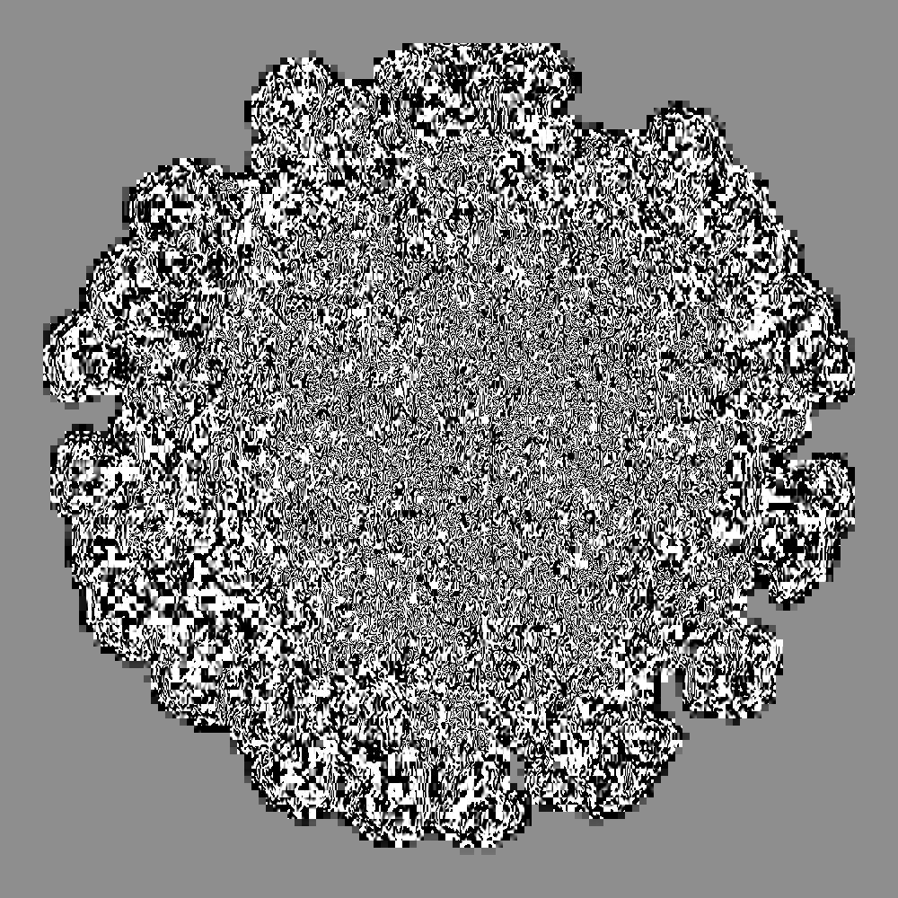

# jpeg-glitch-notebook

- produces glitchy JPEGs – examples: https://www.instagram.com/p/CGhgyU6h3gS/
- uses https://github.com/freder/jpeg-glitch

check out [the jupyter notebook](jpeg-glitch.ipynb)

